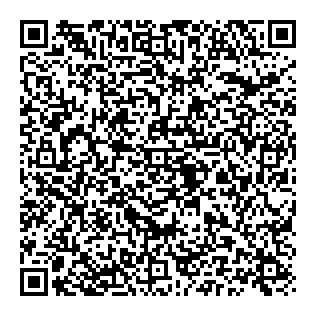

# Daten Codieren TXT

## 1

[Siehe Markdown Datei ASCII-Tabelle.md](ASCII-Tabelle.md)

## 2

[Unicode-Zeichen](https://symbl.cc/de/unicode/table)

## 3

### a

- Textsample1 = ANSI
- Textsample2 = UTF8
- Textsample3 = UTF16 BE BOM

### b

68

### c

- Textsample1 -> ANSI => 68 bytes = 1 Byte pro Zeichen

- Textsample2 -> UTF8 => 71 bytes 1 Byte pro ASCII-Zeichen + mehr als 1 Byte pro nicht ASCII-Zeichen

- Textsample3 -> UTF16 BE BOM => 138 bytes = 2 Bytes für die meisten Zeichen + 2 Bytes am Anfang für BOM

### d

ä, €

### e

BE (Big-Endian) = Das höchstwertigste Byte wird zuerst gespeichert oder übertragen.

LE (Little-Endian) = Das niederwertigste Byte wird zuerst gespeichert oder übertragen.

### f

Solange die Datei nur ASCII-Zeichen enthält wird sich nichts ändern, da diese mit UTF-8 identisch sind.

Wenn die Datei aber Zeichen enthält, welche nicht in ASCII vorkommen, aber in UTF-8, dann werden diese Zeichen nur in UTF-8 richtig dargestellt.

### g

Einzelne ASCII-Zeichen werden durch ein Byte mit einem führenden 0-Bit dargestellt. Mehrbyte-Zeichen beginnen mit einem Byte, das mehrere führende 1-Bits hat, die die Länge der Zeichensequenz anzeigen. Alle folgenden Bytes in der Sequenz beginnen mit 10.

| Anzahl der Bytes | Bits im ersten Byte |
|------------------|---------------------|
| 1                | 0xxxxxxx            |
| 2                | 110xxxxx            |
| 3                | 1110xxxx            |
| 4                | 11110xxx            |

| Zeichen | UTF-8 Bytes (dezimal) | UTF-8 Bytes (binär) |
|---------|-----------------------|---------------------|
| A       | 65                    | 01000001            |
| €       | 226, 130, 172         | 11100010, 10000010, 10101100 |
| あ      | 227, 129, 130         | 11100011, 10000001, 10000010 |

## 4

## 5

