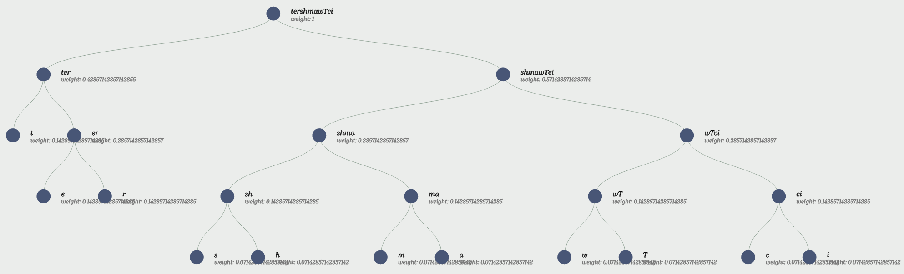

# Daten Komprimieren ANNEX

## 1. Huffman-Algorithmus

Dateisysteme haben auch eine Baumstruktur.

Ein binärer Baum hat bei jedem Knoten, immer höchstens 2 Kinder, dies ist bei nicht binären Bäumen nicht so, da gibt es meistens keine Begrenzung von Kindern.

## 2. Huffman-Algorithmus

### Encode Huffman-Algorithmus



```python
import heapq
from collections import defaultdict

def encode(frequency):
    heap = [[weight, [symbol, ""]] for symbol, weight in frequency.items()]
    heapq.heapify(heap)
    while len(heap) > 1:
        lo = heapq.heappop(heap)
        hi = heapq.heappop(heap)
        for pair in lo[1:]:
            pair[1] = '0' + pair[1]
        for pair in hi[1:]:
            pair[1] = '1' + pair[1]
        heapq.heappush(heap, [lo[0] + hi[0]] + lo[1:] + hi[1:])
    return sorted(heapq.heappop(heap)[1:], key=lambda p: (len(p[-1]), p))

word = "Twitchstreamer"
frequency = defaultdict(int)
for symbol in word:
    frequency[symbol] += 1

huff = encode(frequency)
print("Symbol".ljust(10) + "Huffman Code")
for p in huff:
    print(p[0].ljust(10) + p[1])

"""
Symbol    Huffman Code
t         00
e         100
r         110
T         0100
a         0101
c         0110
h         0111
i         1010
m         1011
s         1110
w         1111
"""

code_table = {p[0]: p[1] for p in huff}

huffman_code = "".join(code_table[char] for char in word)

print("Huffman Code for the word:", huffman_code)
# 110101101000101110001100111111101001101100000010
```

### Decode Huffman-Algorithmus

```python
huffman_code = "110101101000101110001100111111101001101100000010"
code_table = {
    "00": "e",
    "011": "a",
    "010": "s",
    "101": "n",
    "1101": "N",
    "1100": "b",
    "1111": "r",
    "1110": "j",
    "1001": "u",
    "1000": "g"
}

decoded_word = ""
while huffman_code:
    for code, char in code_table.items():
        if huffman_code.startswith(code):
            decoded_word += char
            huffman_code = huffman_code[len(code):]
            break

print(decoded_word) # Nasenbaerjunges
```

## 3. RLC

Mit 5 Bit kann man eine Linie Pixel vom Bild darstellen, wäre es 1 Bit oder kein Bit, da man einfach die Farbe angeben kann.

10100Gelb
1011Gelb, 10Schwarz, 111Gelb

10100Blau
1011Blau, 1Rot, 1Schwarz, 111Blau
100Blau, 10Rot, 1Schwarz, 10Blau, 101Rot, 1Schwarz,5Blau

1Blau

## 4. RLC

```python
import matplotlib.pyplot as plt
import numpy as np

def decode_rlc(rlc):
    color = 0
    matrix = [[0 for _ in range(8)] for _ in range(8)]
    row = col = 0

    for char in rlc:
        for _ in range(int(char)):
            matrix[row][col] = color
            col += 1
            if col == 8:
                col = 0
                row += 1
        color = 1 - color

    return matrix

rlc = "010100011110010010010010010010010010010110010110010010010010010010010010001"
matrix = decode_rlc(rlc)

plt.imshow(matrix, cmap='gray', vmin=0, vmax=1)
plt.show()
```

Skript hat nicht funktioniert.

## 5. LZW-Verfahren

### a

LZW Codierung

```python
def lzw_encode(input_string):
    dictionary = {chr(i): i for i in range(256)}
    p = ""
    result = []
    for c in input_string:
        pc = p + c
        if pc in dictionary:
            p = pc
        else:
            result.append(dictionary[p])
            dictionary[pc] = len(dictionary)
            p = c
    if p:
        result.append(dictionary[p])
    return result

word = "ANANAS"
lzw_code = lzw_encode(word)
print("LZW Code for the word:", lzw_code)
# LZW Code for the word: [65, 78, 256, 65, 83]
```

### b

```python
def lzw_decompress(compressed):
    dict_size = 256
    dictionary = {i: chr(i) for i in range(dict_size)}

    w = chr(compressed[0])
    result = w

    for k in compressed[1:]:
        if k in dictionary:
            entry = dictionary[k]
        else:
            entry = w + w[0]

        result += entry

        dictionary[dict_size] = w + entry[0]
        dict_size += 1

        w = entry

    return result

lzw_code = [ord(c) for c in "ERDBE"] + [256] + [ord(c) for c in "KL"] + [260]
print(lzw_decompress(lzw_code))  # ERDBEERKLEE
```

## 6. BWT (Burrows-Wheeler-Transformation)

```python
def bwt(s):
    s = s + "$"
    table = sorted(s[i:] + s[:i] for i in range(len(s)))
    last_column = [row[-1] for row in table]
    return "".join(last_column)

def ibwt(r):
    table = [""] * len(r)
    for _ in range(len(r)):
        table = sorted(r[i] + table[i] for i in range(len(r)))
    s = [row for row in table if row.endswith("$")][0]
    return s.rstrip("$")

# a
original = "ANANAS"
transformed = bwt(original)
reversed_transform = ibwt(transformed)

print(f"Original: {original}")
print(f"Transformed: {transformed}")
print(f"Reversed: {reversed_transform}")

# b
transformed = "IICRTGH6"
reversed_transform = ibwt(transformed)
print(f"Transformed: {transformed}")
print(f"Reversed: {reversed_transform}")
```

Skript hat nicht funktioniert.

## 6. ZIP-Komprimierung

## 7
